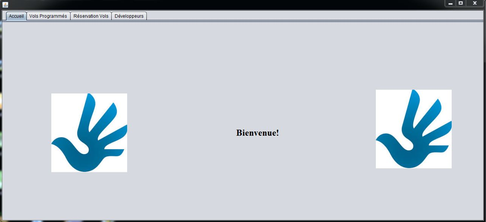
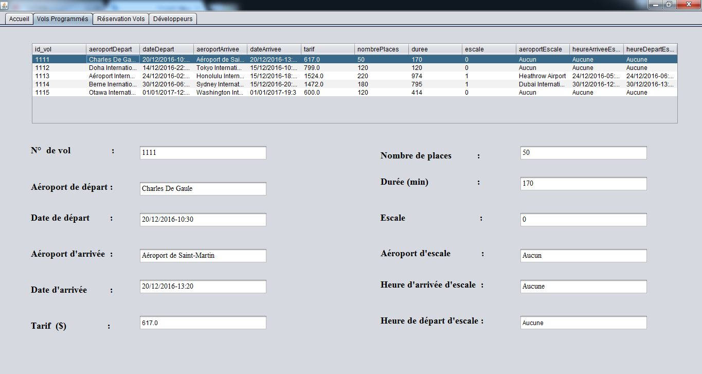
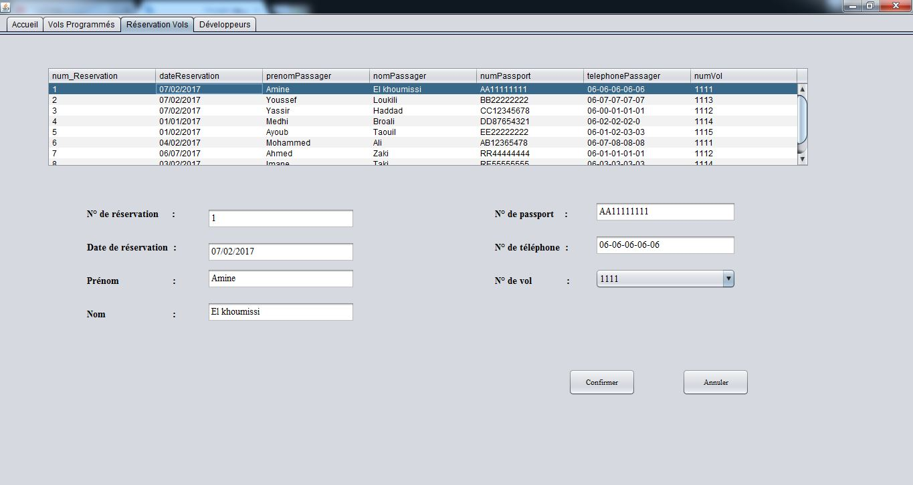
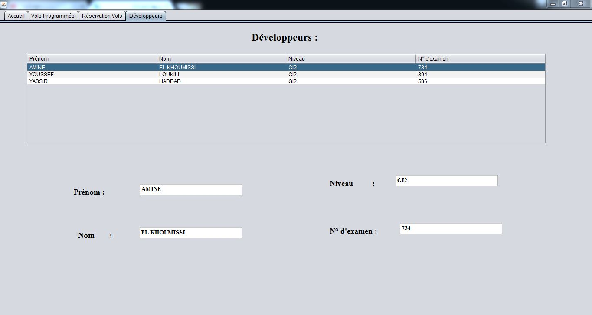

# Nom du projet:        Gestion des réservations de vols

---

## Table des matières:

- [Description](#description)
- [Technologies](#technologies)
- [Installation](#installation)
- [Captures](#captures)

---

## Description:

Cette application permet à un client de réserver et/ou d'annuler la réservation d'un vol 
d'une compagnie aérienne.
 ---
 
 ## Technologies:

- Bibliothèque graphique Swing du langage Java
- Base de données SQLite

---

## Installation:

° Première méthode:

- Cloner le projet
- Exécuter le projet autant que "Java Application"

° Deuxième  méthode:

- Télécherger le projet en cliquant sur "Download" au lieu de le cloner
- Décompresser le projet, accèder au dossier "exécutable" et exécuter le fichier "GestionVols.exe"

---

## Captures:

- Page "Accueil":

- Page "Vols Programmés":

- Page "Réservation Vols":

- Page "Développeurs":

---

- [Début de page](#table-des-matières)

